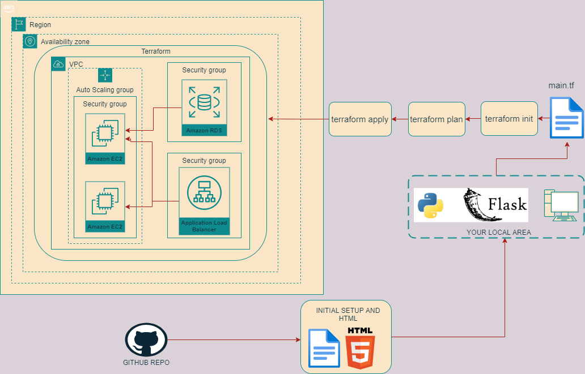
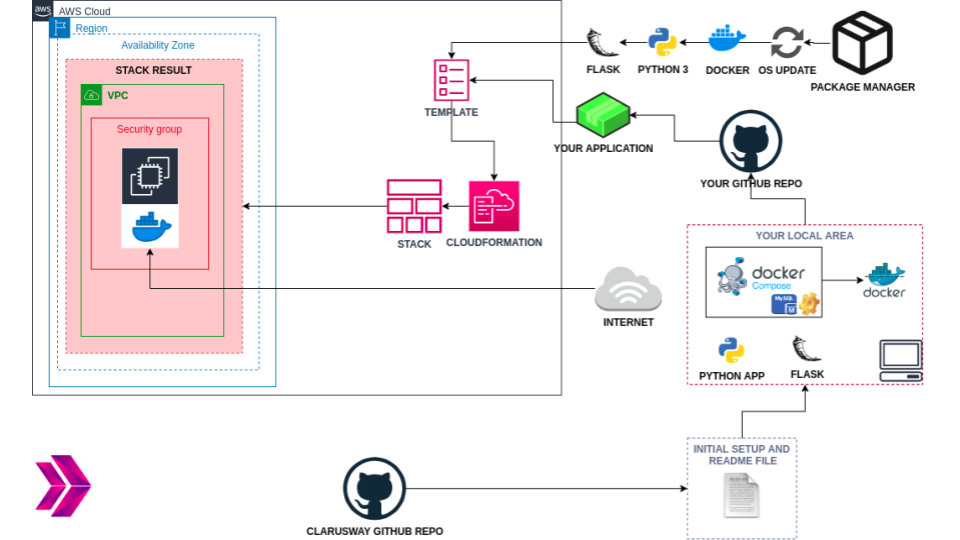
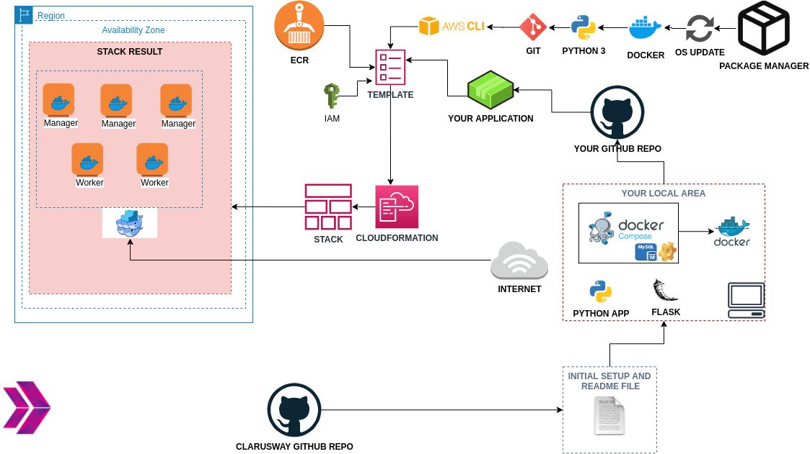

# COURSE-PROJECTS--AWS-DEVOPS
This repository shows the projects I have completed during my education at Clarusway. Repo is build for all my portfolios and projects.

## Python Hands-on Trainings

List of hands-on trainings within Python workshop as follows;

<!---->

- ### [Creating First Flask Application - Hello World](./AWS/Portfolio/flask-01-02-hello-world-app-Jinja-Template/README.md)

    Purpose of the this hands-on training is to give the students quick introductory knowledge of how to create a Flask web application on local.

- ### [Handling Routes and Templates with Flask Web Application](./AWS/Portfolio/flask-03-handling-routes-and-if-for/README.md)

    Purpose of the this hands-on training is to give the students introductory knowledge of how to handle routes and use html templates within a Flask web application on Amazon Linux 2 EC2 instance. 

- ### [Handling Routes and Templates with Flask Web Application](./AWS/Portfolio/flask-04-handling-forms-POST-GET-Methods/README.md)

    Purpose of the this hands-on training is to give the students introductory knowledge of how to handle forms.

- ### [Handling Forms and SQL with Flask Web Application](./AWS/Portfolio/flask-05-Handling-SQL-with-Flask-Web-Application/README.md)

    Purpose of the this hands-on training is to give the students introductory knowledge of how to handle forms, how to connect to database and how to use sql within Flask web application on Amazon Linux 2 EC2 instance. 

## AWS Projects

List of projects as follows;

- ### [Project-101-Kittens-carousel-static-website-ec2](./AWS/Project-101-Kittens-carousel-static-website-ec2/README.md)

<!---->

    Kittens Carousel is a static website application deployed with Apache Web Server on AWS Elastic Compute Cloud (EC2) Instance using AWS Cloudformation Service. 

- ### [Project-102-Roman-Numerals-Converter](./AWS/Project-102-Roman-Numerals-Converter/README.md)

<!---->

    The Roman Numerals Converter Application aims to convert the given number to the Roman numerals. The application is to be coded in Python and deployed as a web application with Flask on AWS Elastic Compute Cloud (EC2) Instance using AWS Cloudformation and CLI Services. 

- ### [Project-103-Phonebook-Application](./AWS/Project-103-Phonebook-Application/README.md)

<!---->

    The Phonebook Application aims to create a phonebook application in Python and deployed as a web application with Flask on AWS Application Load Balancer with Auto Scaling Group of Elastic Compute Cloud (EC2) Instances and Relational Database Service (RDS) using AWS Cloudformation Service.

- ### [Project-104-Kittens-carousel-static-web-s3-cf](./AWS/Project-104-Kittens-carousel-static-web-s3-cf/README.md)

<!---->

    Kittens Carousel is a static website application deployed on AWS Simple Storage Service (S3), served through Cloudfront and Route 53 using AWS Cloudformation Service.

- ### [Project-501-Capstone-Project-Blog-Page-App-(Django)-on-AWS-Environment](./AWS/Project-501-Capstone-Project-Blog-Page-App-(Django)-on-AWS-Environment/README.md)

<!---on-AWS-Environment/capstone.jpg)-->

    The Clarusway Blog Page Application aims to deploy blog application as a web application written Django Framework on AWS Cloud Infrastructure. This infrastructure has Application Load Balancer with Auto Scaling Group of Elastic Compute Cloud (EC2) Instances and Relational Database Service (RDS) on defined VPC. Also, The Cloudfront and Route 53 services are located in front of the architecture and manage the traffic in secure. User is able to upload pictures and videos on own blog page and these are kept on S3 Bucket. This architecture will be created by Firms DevOps Guy.

## DevOps Projects

List of projects as follows;

- ### [201-Create-Apache-Servers-with-Terraform](./DevOps/201-Create-Apache-Servers-with-Terraform/README.md)

<!---->

    This project aims to create two apache servers in AWS with using Terraform to give students the understanding to building infrastructure with Terraform.

- ### [202-Terraform-Phonebook-Application-deployed-on-AWS](./DevOps/202-Terraform-Phonebook-Application-deployed-on-AWS/README.md)

<!---->

    The Phonebook Application aims to create a phonebook application in Python and deployed as a web application with Flask on AWS Application Load Balancer with Auto Scaling Group of Elastic Compute Cloud (EC2) Instances and Relational Database Service (RDS) using Terraform.

- ### [203-dockerization-bookstore-api-on-python-flask-mysql](./DevOps/203-dockerization-bookstore-api-on-python-flask-mysql/README.md)

<!---->

Bookstore Web API Application aims to create a bookstore web service using Docker to give students the understanding to dockerization of an application. The application code is to be deployed as a RESTful web service with Flask using Dockerfile and Docker Compose on AWS Elastic Compute Cloud (EC2) Instance using Terraform.

- ### [204-docker-swarm-deployment-of-phonebook-app-on-python-flask-mysql](./DevOps/204-docker-swarm-deployment-of-phonebook-app-on-python-flask-mysql/README.md)

This project aims to deploy the Phonebook Application web application with Docker Swarm on Elastic Compute Cloud (EC2) Instances by pulling the app images from the AWS Elastic Container Registry (ECR) repository.

- ### [205-jenkins-pipeline-for-phonebook-app-on-docker-swarm](./DevOps/205-jenkins-pipeline-for-phonebook-app-on-docker-swarm/README.md)

This project aims to create a Jenkins pipeline to deploy the Phonebook Application web application with Docker Swarm on Elastic Compute Cloud (EC2) Instances by pulling the app images from the AWS Elastic Container Registry (ECR) repository.

- ### [206-Kubernetes-Microservice-Phonebook](./DevOps/206-Kubernetes-Microservice-Phonebook/README.md)

Phonebook Microservice Web Application aims to create a web application with MySQL Database using Docker and Kubernetes to give students the understanding of Microservice architecture. In this application, we have a frontend service and a backend service to interact with database service. Each service will be managed by a Kubernetes deployment. The backend service will be a gateway for the application and it will serve the necessary web pages for create, delete and update operations while the frontend service will serve a search page in order to conduct read operations. To preserve the data in the database, persistent volume and persistent volume claim concepts should be adopted.

- ### [207-Ansible-publish-website-postgresql-nodejs-react](./DevOps/207-Ansible-publish-website-postgresql-nodejs-react/README.md)

The Clarusway Web-Page Application aims to deploy web-page written Nodejs and React Frameworks on AWS Cloud Infrastructure using Ansible. Building infrastructure process is managing with control node utilizing Ansible. This infrastructure has 1 control node and 3 EC2's as worker node. These EC2's will be launched on AWS console. Web-page has 3 main components which are postgresql, nodejs, and react. Each component is serving in Docker container on EC2s dedicated for them. Postgresql is serving as Database of web-page. Nodejs controls backend part of web-side and react controls frontend side of web-page. The code was written by Clarusway's Developers and architecture will be created by Clarusway's AWS & DevOps Team.

- ### [502-microservices-ci-cd-pipeline-with-database](./DevOps/502-microservices-ci-cd-pipeline-with-database/README.md)

This project aims to create full CI/CD Pipeline for microservice based applications using [Spring Petclinic Microservices Application](https://github.com/spring-petclinic/spring-petclinic-microservices). Jenkins Server deployed on Elastic Compute Cloud (EC2) Instance is used as CI/CD Server to build pipelines.
