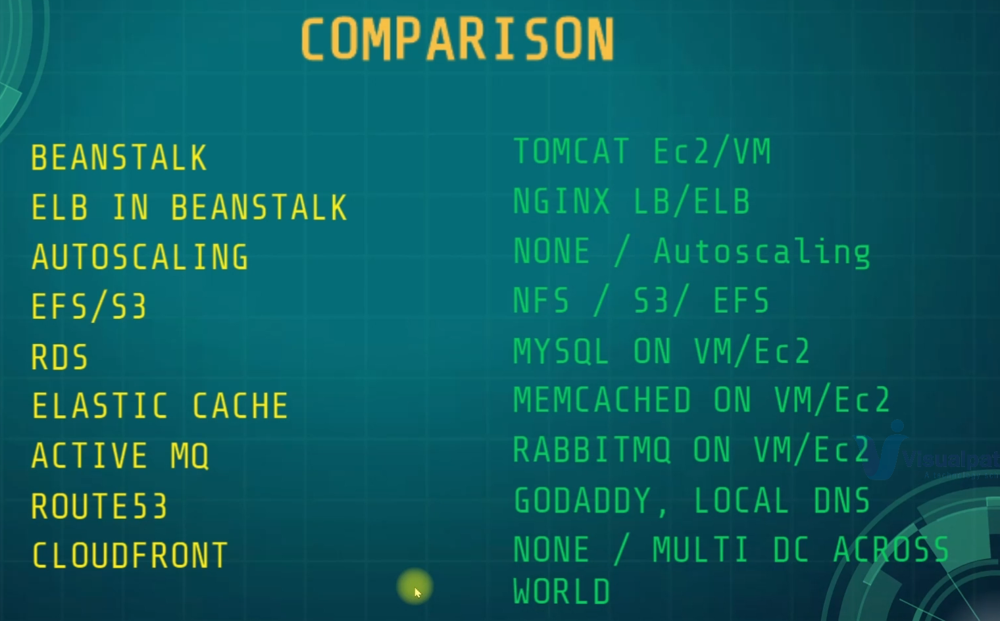

# Problem

-   Operational Overhead
-   Struggling with Uptime & Scalling
-   Upfront CapEx & Regular OpEx
-   Manual Process / Difficult to Automate

# Solution

-   Cloud Setup
    -   Automation
    -   PASS / SAAS
    -   IAAS
    -   Payasyougo
    -   Flexibility

# AWS SERVICES
    
-   BEANSTALK 
    - VM For Tomcat (app server)
    - Nginx LB Replacement
    - Automation for VM scalling
-   S3/EFS
    - Storage

-   RDS instance 
    - DATABASE (PAAS)(scaling/backup)
-   Elastic Cache
    - Memcache
-   Active MQ
    - Rabbit MQ
-   Route53
    - DNS
- CloudFront
    - Content Delivery Network

